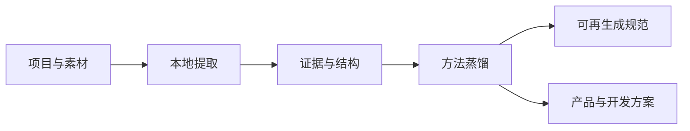

# 鲲鹏 Skill

> 适用于Vibe Coding和YES工程师的skill，能够把网页、开源仓库、产品和多媒体素材蒸馏成可复用的方法论、技术选型、UI设计理念与产品方案。

<p align="center">
  
</p>

<p align="center">
  
  
  
  
</p>

鲲鹏 Skill 目的是能够完整蒸馏代码仓库、网页动效、UI设计理念、视频、图片或文章，并把其中高价值的东西整理成其他智能体可以继续执行的规范。

这些结果既能进入本地资料库，成为个人知识库随时被提取，也能直接用于网页UI、App、小程序、游戏、Agent、桌面端和品牌视觉等新产品的规划。

## 它解决什么问题

- **收集不再只是存链接**：保留核心功能、技术栈、核心流程、数据流、外部依赖、UI/交互亮点和整理重点。
- **蒸馏不止输出形容词**：把“高级、电影感、像某种风格”展开成构图、参数、节奏、步骤、边界和验收条件。
- **参考库真正参与产品决策**：规划产品时检索本地资料库，综合已有经验，但不向最终使用者暴露内部来源和检索过程。
- **非技术人员也能读懂**：先解释用户、成本和维护后果，再给技术名称，不把框架选择重新丢给使用者。
- **长素材不会一次塞满上下文**：视频先做时间轴，文档先分块，资料库先索引，再按需深读。

## 四种工作模式

| 模式 | 适合场景 | 最终得到什么 |
| --- | --- | --- |
| 收录 | 代码仓库、网站、App、交互产品 | 可长期复查的项目档案 |
| 蒸馏 | 视频、图片、文章、品牌、UI、工作流 | 可迁移规律与可再生成规范 |
| 规划 | 开发网页、App、小程序、游戏、Agent 等 | 产品、视觉、技术与实施方案 |
| 维护 | 资料库新增、更新或产物检查 | 增量索引与质量报告 |



## 交互原则

只有用户要规划或开发新产品时，Skill 才会一次询问 `1–5` 个真正影响方案的问题。

## 多媒体能力

标准版优先调用已部署的完整本地处理链，不额外调用托管推理 API：

| 来源 | 本地处理 | 主要过程文件 |
| --- | --- | --- |
| 视频 | FFmpeg、faster-whisper、PySceneDetect、OpenCV、PaddleOCR、librosa | 转写、字幕、镜头、关键帧、OCR、音频节奏、时间轴 |
| 图片 | Pillow、OpenCV、PaddleOCR | 尺寸、色彩、构图指标、文字、批量联系表 |
| 文章/文档 | pypdf、python-docx、python-pptx、trafilatura、PaddleOCR | 全文、结构、自然分块、文风统计 |
| 代码与网站 | 宿主文件工具、浏览器交互能力 | 主线结构、页面状态、流程、数据与依赖 |

“反向提示词”不会被单独做成一段万能文本。最终蒸馏结果会形成模型无关的**可再生成规范**：明确不可变项、内容变量、生成顺序、参数、负向约束和验收表，再按 Seedance、图像模型或写作模型的格式进行适配。


## 支持的 Agent

Skill 使用通用的 `SKILL.md + references/ + scripts/` 结构。以下宿主可以使用同一份内容，宿主专用元数据只作为可选增强：

| Agent | 常见挂载位置 | 说明 |
| --- | --- | --- |
| Codex | `$CODEX_HOME/skills/kunpeng-skill` | 保留 `agents/openai.yaml` |
| Claude Code | `.claude/skills/kunpeng-skill` 或用户级 Skills 目录 | 直接读取 `SKILL.md` |
| OpenCode | `.opencode/skills/kunpeng-skill` 或兼容目录 | 允许执行本地 Python 与 FFmpeg |
| WorkBuddy | 当前版本配置的 Skills 目录 | 挂载完整目录，不只复制 `SKILL.md` |
| Hermes | WSL 内配置的 Skills 目录 | 建议 Skill 和虚拟环境都放在 WSL 文件系统 |
| 其他 Agent | 支持 Agent Skills 或可读取规则文件的目录 | 可通过 `AGENTS.md` 指向本 Skill |

不同版本的目录约定可能变化，以宿主当前官方文档和 Skills 诊断结果为准。

## 快速配置

### 1. 挂载完整目录

复制或链接整个 `kunpeng-skill`，必须同时保留：

```text
kunpeng-skill/
├── SKILL.md
├── README.md
├── agents/
├── assets/
├── references/
├── scripts/
└── requirements-standard.txt
```

### 2. 创建项目级 Python 环境

在 Skill 根目录执行：

```bash
python -m venv .venv
```

Windows PowerShell：

```powershell
.\.venv\Scripts\python.exe -m pip install --upgrade pip
.\.venv\Scripts\python.exe -m pip install -r requirements-standard.txt
```

Linux、macOS 或 WSL：

```bash
./.venv/bin/python -m pip install --upgrade pip
./.venv/bin/python -m pip install -r requirements-standard.txt
```

### 3. 安装 FFmpeg

FFmpeg 从[官方下载页](https://ffmpeg.org/download.html)获取。它会修改系统环境，必须由使用者主动执行：

```text
Windows: winget install Gyan.FFmpeg
Ubuntu/WSL: sudo apt install ffmpeg
macOS: brew install ffmpeg
```

### 4. 官方获取地址

目标电脑只需手动安装 Python 和 FFmpeg；其余 Python 组件会由 `requirements-standard.txt` 安装到 Skill 自己的 `.venv`，通常不需要逐个下载。

| 组件 | 官方地址 | 本 Skill 中的安装方式 |
| --- | --- | --- |
| Python 3.10–3.12 | [Python Downloads](https://www.python.org/downloads/) | 手动安装，推荐 3.11 x64。 |
| FFmpeg / ffprobe | [FFmpeg Downloads](https://ffmpeg.org/download.html) | 使用系统包管理器或官方下载页提供的构建。 |
| faster-whisper | [SYSTRAN/faster-whisper](https://github.com/SYSTRAN/faster-whisper) | `requirements-standard.txt` 自动安装。 |
| PaddlePaddle / PaddleOCR | [PaddlePaddle 安装指南](https://www.paddlepaddle.org.cn/install/quick)、[PaddleOCR 源码](https://github.com/PaddlePaddle/PaddleOCR) | 默认安装 CPU 版；GPU 版按官方 CUDA 对照表替换。 |
| PySceneDetect | [Breakthrough/PySceneDetect](https://github.com/Breakthrough/PySceneDetect) | `requirements-standard.txt` 自动安装。 |
| OpenCV | [opencv/opencv](https://github.com/opencv/opencv) | 自动安装无界面的 Python 运行版。 |
| librosa | [librosa/librosa](https://github.com/librosa/librosa) | `requirements-standard.txt` 自动安装。 |
| 文档解析器 | [pypdf](https://github.com/py-pdf/pypdf)、[python-docx](https://github.com/python-openxml/python-docx)、[python-pptx](https://github.com/scanny/python-pptx)、[trafilatura](https://github.com/adbar/trafilatura) | `requirements-standard.txt` 自动安装。 |

首次运行 faster-whisper 或 PaddleOCR 时还会从其公开模型仓库下载免费模型文件；这不是付费 API 调用。完整来源、许可证和离线模型说明见[本地工具链](references/local-toolchain.md)。

### 5. 检查能力

统一入口会自动优先使用 Skill 自己的 `.venv`：

```bash
python scripts/kunpeng.py probe --profile video
python scripts/kunpeng.py probe --profile image
python scripts/kunpeng.py probe --profile document
```

以上是普通任务的能力发现，即使缺工具也会输出替代路由并继续。安装完成后的全链验收使用：

```bash
python scripts/kunpeng.py probe --profile all --strict
```

模型准备完成后，可以指定本地模型目录，并使用 `--offline` 完全离线处理。

## 执行优先级与结果

执行顺序固定为：**已部署标准本地工具 → 已实际核实的 Agent 能力 → 确定性本地替代 → 标记未覆盖**。标准组件可用时不会为了省事跳过，只对缺失或失败的单项降级。

| 状态 | 代表什么 |
| --- | --- |
| `complete` | 当前素材适用的标准组件全部成功。 |
| `degraded` | 标准组件有缺口，但替代方法已实际覆盖。 |
| `partial` | 仍有重要内容没有覆盖。 |
| `failed` | 素材无法读取或核心流程不可用。 |
| `not_applicable` | 素材不需要该阶段，例如没有音轨。 |

脚本无法自行判断 Codex、Claude Code、WorkBuddy、OpenCode 或 Hermes 当前会话是否具备视觉等宿主工具，因此会列出 `host_review_required` 并先保持 `partial`。Agent 必须真的打开相应素材后才能在最终报告中认定为 `degraded` 覆盖，不能只凭“宿主支持”推断完成。

## Hermes 与 WSL

Hermes 运行在 WSL 时，不要直接复用 Windows 创建的 `.venv`。在 WSL 文件系统中放置 Skill 并重新创建 Linux 虚拟环境；Windows 资料可以继续通过 `/mnt/<盘符>/...` 只读访问。

Skill、模型缓存和 `.venv` 放在 WSL 文件系统通常更快；大型视频可以留在 Windows 盘，但大量关键帧和 OCR 过程文件建议输出到 WSL 工作目录。

## 使用示例

Codex：

```text
使用 $kunpeng-skill 完整收录这个项目，保存到我的资料库。
使用 $kunpeng-skill 蒸馏这批视频，输出同风格新内容的可再生成规范。
使用 $kunpeng-skill 根据现有资料库，规划一个面向设计师的桌面 App。
```

Claude Code 或其他宿主：

```text
请使用 kunpeng-skill 分析这个图片目录，提取稳定视觉系统和验收标准。
请使用 kunpeng-skill 蒸馏这些文章的表达方法，用于新主题写作。
```

## CLI 入口

```bash
python scripts/kunpeng.py probe --profile <video|image|document>
python scripts/kunpeng.py video <视频或目录> --output <过程目录>
python scripts/kunpeng.py images <图片或目录> --output <过程目录>
python scripts/kunpeng.py documents <文档或目录> --output <过程目录>
python scripts/kunpeng.py compare <参考文件> <候选文件> --mode style
python scripts/kunpeng.py index --library <资料库目录>
python scripts/kunpeng.py search --index <索引文件> --query "产品需求" --limit 6
python scripts/kunpeng.py validate <产物路径> --profile distillation
```

脚本默认只读源素材，不覆盖已有输出目录。只有明确继续中断任务时才使用 `--resume`。

## 本地与费用边界

- 媒体提取、ASR、OCR、镜头切分、音频分析和文档解析全部在本机完成。
- Skill 不读取 API Key，也不会自行调用额外的 OpenAI、Claude、Gemini 或其他托管推理 API。
- 宿主 Agent 本身的订阅或调用费用仍按宿主服务规则计算，不属于 Skill 增加的媒体处理费用。
- 首次模型下载会使用网络和磁盘；模型准备完成后可以离线运行。

## 结果边界

- 忠实重建只适用于用户拥有或获得授权的素材。
- 不承诺逐帧、逐像素或逐字完全一致；生成模型能力和随机性仍会影响结果。
- 颜色、边缘、节奏和文风统计只是证据，最终语义、审美和连续性必须由智能体复核。
- 同风格任务迁移结构和表现机制，不复制 Logo、角色、整套品牌身份或标志性长段内容。

## 进一步阅读

- [本地工具链与 Agent 配置](references/local-toolchain.md)
- [视频蒸馏](references/video-distillation.md)
- [图片与视觉蒸馏](references/image-distillation.md)
- [文章与表达蒸馏](references/writing-distillation.md)
- [可再生成规范](references/reproduction-standard.md)
- [资料库检索](references/library-retrieval.md)
- [质量门](references/quality-gates.md)
